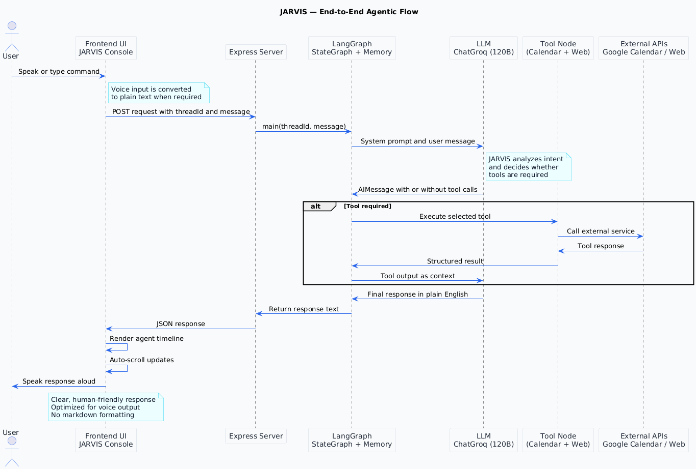

# JARVIS — Personal Agentic AI Assistant

JARVIS (Just A Rather Very Intelligent System) is a **voice-first, agentic AI assistant** built end to end using **LLMs, LangGraph orchestration, and real-world tools**.  
Unlike traditional chatbots, JARVIS can **reason, decide, and take actions** such as searching the web and managing calendar events.

This project demonstrates how to design and build a **production-style agentic system** that combines LLM reasoning, tool orchestration, memory, and voice interaction.

---

## ✨ Key Capabilities

- 🎙️ **Voice-first interaction** (speech-to-text and text-to-speech)
- 🧠 **Agentic reasoning** using LLM-driven decision making
- 🔁 **Tool orchestration** with dynamic tool selection
- 🌐 **Real-time information retrieval** via web search
- 📅 **Google Calendar automation**
  - Query events
  - Create meetings
  - Cancel meetings using natural language
- 🗂️ **Conversation memory** across turns
- 🔊 **Human-friendly responses** optimized for voice output

---

## 🧠 What Makes This Agentic?

JARVIS is not a simple chatbot.

It follows an **agent loop**:
1. Understand user intent
2. Decide whether a tool is required
3. Execute the tool if needed
4. Feed the result back to the LLM
5. Generate a final, natural language response

This loop continues until no further actions are required.

---

## 🏗️ High-Level Architecture

Each layer has a single responsibility, making the system modular and extensible.

---

## 🛠️ Tech Stack

### Frontend
- HTML
- Tailwind CSS
- JavaScript
- Web Speech API (Speech Recognition)
- Web Speech API (Text-to-Speech)

### Backend
- Node.js
- Express.js
- REST APIs

### Agent Orchestration
- LangGraph (StateGraph)
- LangChain
- ToolNode
- MemorySaver (conversation-level memory)

### LLM
- ChatGroq
- Large Language Models (LLMs)
- Tool / Function Calling
- Prompt Engineering

### Integrations
- Google Calendar API
- Web Search APIs
- External REST APIs

---

## 📁 Project Structure

---

## 🔄 Agent Orchestration Flow

The agent is implemented using **LangGraph**:

- `assistant` node: Calls the LLM
- `tools` node: Executes selected tools
- Conditional edges decide whether to:
  - Continue reasoning
  - Execute tools
  - End the flow

Conversation state is preserved per thread using `MemorySaver`.

---

## 🧾 System Prompt Design

The system prompt enforces:
- Plain English output
- No markdown or tables
- Voice-friendly responses
- Clear and calm assistant tone

This ensures responses work seamlessly for both **UI rendering** and **speech synthesis**.

---

